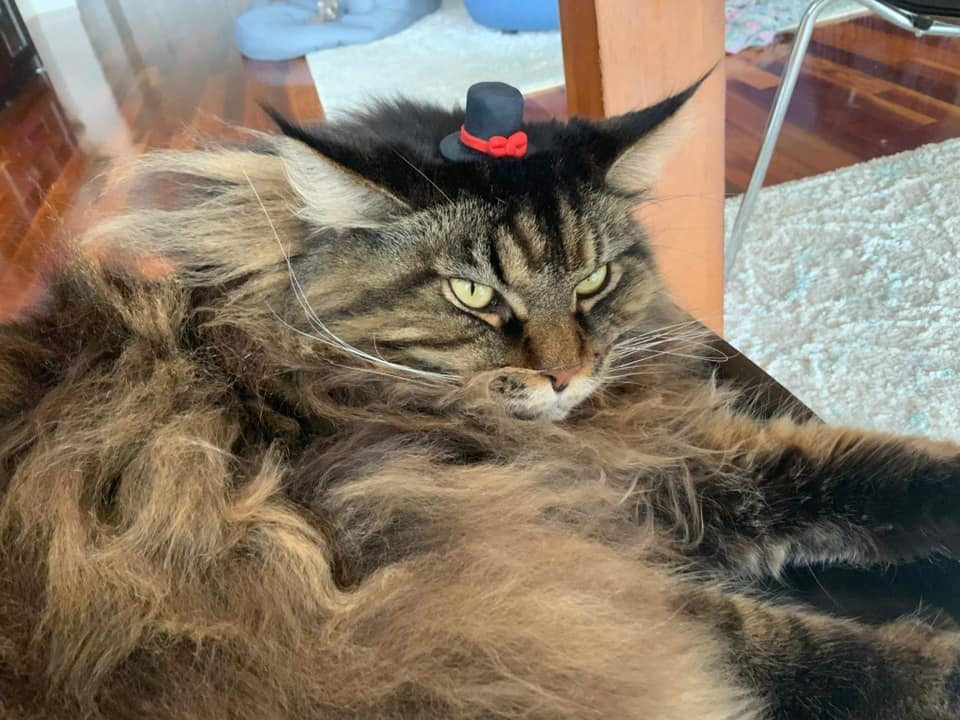
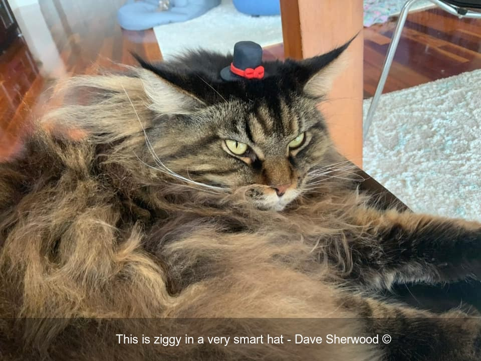

# Gleam Image Export Captioner

Takes a Gleam export of media and adds captions with the owner.

## Before:

## After:

# Step 0: Install required tools
## Step 0.1:
Install Ruby, Bundler. I use [rbenv](https://github.com/rbenv/rbenv) to install Ruby 3.3.0 specifically.

## Step 0.2: 
Run `bundle install`

This will take a while since it has to install ImageMagick.

## Step 0.3:

You can test it by running E.g. `bundle exec ruby run.rb "./john-resize-tester.zip"` 

# Step 2: Get your own export from Gleam

There are two ways to get a media export in Gleam:
* The Actions/Entries page of your Competition/Reward 
* Any Accepted/Pending/Rejected page in a Gleam gallery

# Step 3: Run it on your data

Run `bundle exec ruby run.rb "[my zip export of media]"`

E.g. `bundle exec ruby run.rb "/Users/ponny/Downloads/my-competition.zip"`

# Step 4: Review results! 🎉 

The results will be in ./work_dir/{your zip file name}/output